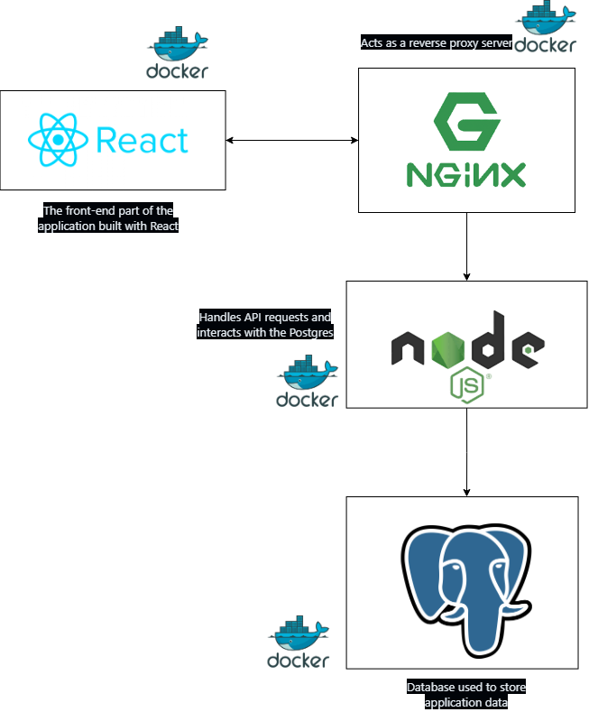

# Simple Full Stack app

In this repo you'll find the code to run a basic dockerized web app.

This can serve as starting point for ANY full stack dockerized app! 

## Main Components

This project consists of the following main components:

1. **Client**: The front-end part of the application built with React.
2. **Server**: The back-end part of the application built with Node.js and Express.
3. **Database**: PostgreSQL is used as the database to store application data.
4. **Proxy Server**: Nginx is used as a reverse proxy server to forward requests to the Node.js server.

## Basic Functionality

The user pings the Node.js server from the front end, and the response gets inserted into a PostgreSQL table.

## Prerequisites

Before running the application, ensure you have the following installed:

1. **Docker Desktop**: Download and install Docker Desktop from [Docker's official website](https://www.docker.com/products/docker-desktop).
2. **Git**: Download and install Git from [Git's official website](https://git-scm.com/).

## How to Run the App

Follow these steps to run the application:

1. **Clone the repository**:
    ```sh
    https://github.com/JoseBlancoSiles/dockerized-full-stack-react-node-app.git
    cd dockerized-full-stack-react-node-app
    ```

2. **Set up environment variables**:
    Create a `.env` file in the root directory and add the following:
    ```sh
    DB_USER=your_db_user # postgres
    DB_HOST=your_db_host # postgres
    DB_DATABASE=your_db_name # postgres
    DB_PASSWORD=your_db_password # choose your password
    DB_PORT=your_db_port # 5432 suggested
    ```

3. **Start the application using Docker Compose**:
    ```sh
    docker-compose up --build
    ```

4. **Access the application**:
    Open your browser and go to `http://localhost:3000`.
    Ping the server
    response should be : pong!

   After that, you can check if that response was inserted into the postgres table:
   ```sh
   docker exec -it postgres psql -U postgres
   ```
   ```sql
   SELECT * FROM pings;
   ```

## Architecture

Here is a basic architecture diagram of the application:



## License

This project is licensed under the MIT License.

